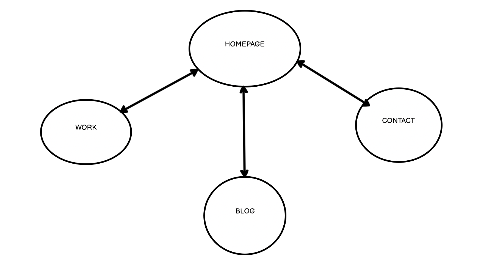
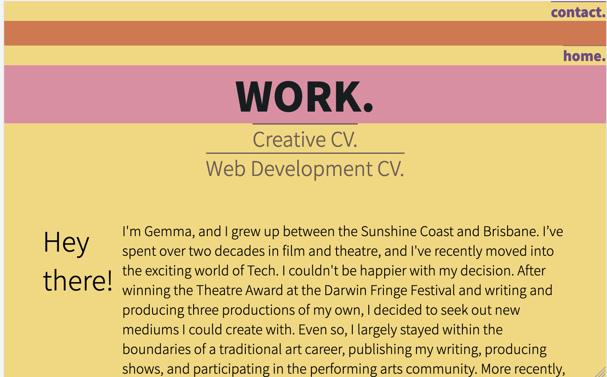

# My Portfolio Website

## The Published Site
http://127.0.0.1:5500/index.html
## My GitHub Repository
https://github.com/gemmaelsom/website

## Purpose
The purpose of this site is to showcase my skills, education and work history, and interests in one place. The goal is to attract potential employers or other developers that may like to work with me. 

## Functionality / features
The main features of the website are:
- Hover feature to change colour of Nav Bar 
- Animation of colours on the Heading of each page bar index.html
- Rotation feature on Social Media icons upon hover
- Rotation feature on Photos in Blog
- Full responsiveness from mobile to desktop
- Links to downloadable PDF copies of my Resume
- Active links to my GitHub, LinkedIn and Twitter accounts
- Active "Contact Me" form that sends an email to me directly

## Sitemap

## Screenshots

## Target audience
The target audience for my portfolio site is primarily perspective employers and collaborators. 

## Tech stack (e.g. html, css, deployment platform, etc)
- HTML
- CSS
- GitHub
- Netlify
- Formspree

